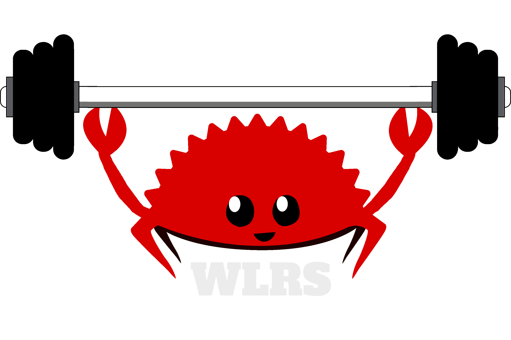

# WLRS
WLRS (*[/julərs/](http://ipa-reader.xyz/?text=jul%C9%99rs)*) is a WIP workout tracker.

## TODO
- [x] Json for data retrieval
- [X] figure out HTML + CSS Templating
  - [X] Workout View
  - [X] Status Codes
  - [X] Workout create
    - [X] When adding exercises form a json, render off the json. (Editing/deleting exerices will be possible then)
  - [X] Front page
  - [X] Login/Auth
    - [X] Register Account
    - [X] Login
      - [ ] Remember Login
      - [ ] Add validation (frontend, backend has validation)
    - [ ] Delete
  - [X] User Home Page
    - [X] Summaries of workouts
      - [ ] Add "New Workout" panel for users with less than 3 workouts
      - [ ] View All page
    - [ ] Progression statistics/graphcs
    - [ ] Body weight graph?
  - [ ] Account Page
    - [ ] Global unit preference
- [ ] Add Support for other DB types (diesel?) such as MariaDB, Postgres, MySQL
- [ ] Extend error handling with global error codes and don't handle `Result<>`s with `unwrap()`s
- [ ] Organize api
- [ ] [Ratelimiting](https://lib.rs/crates/rocket-governor)
- [X] Compression
  - [X] Decrease latency/prcoessing times, perhaps pre-compress ( Basic json adds +/-16ms of response time)

### Ideas for the future

- [ ] GPX Support
- [ ] Exercise lists, with muscle group visualization (like wger)
- [ ] Native mobile applications (Svelte-native?)
