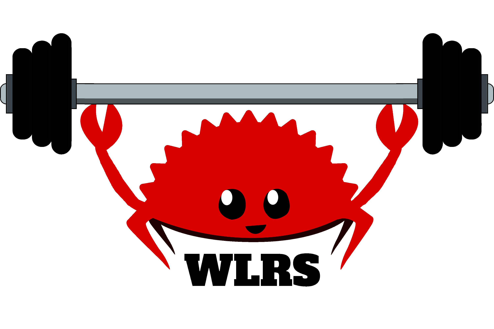

# WLRS 

WLRS (*[/julərs/](http://ipa-reader.xyz/?text=jul%C9%99rs)*) is a WIP workout tracker that is bLaZiNgLy FaSt :rocket: :rocket:.

## TODO

- [x] Make impl for WorkoutEntry so we can parse after retrieving from DB
- [x] Json for data stuff
- [X] figure out HTML + CSS Templating
  - [X] Workout View
  - [X] Status Codes
  - [ ] Workout create
  - [ ] Homepage
  - [ ] Login/Auth
- [ ] Authentication + Cookies
- [X] switch date to unix timestamp (and start/end times)
- [ ] Switch from sqlite DB once stuff is working great. (Using sqlite because my dev environment changes frequently)
- [ ] Minimize dependencies
  - Not about minimization, but checkout Perseus

## Design Choices/Questions
- Should I render data server or client side?
  - Most of it will probably be server side, need to research pros and cons